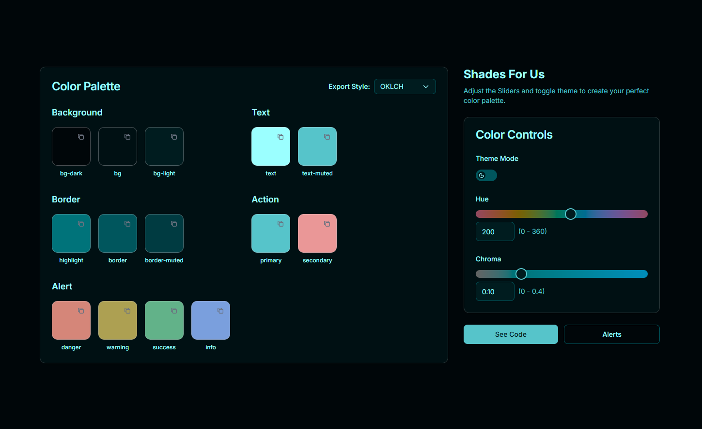
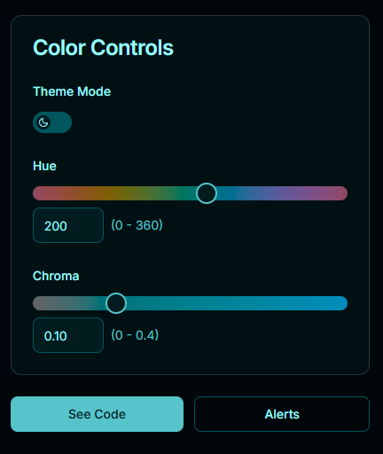
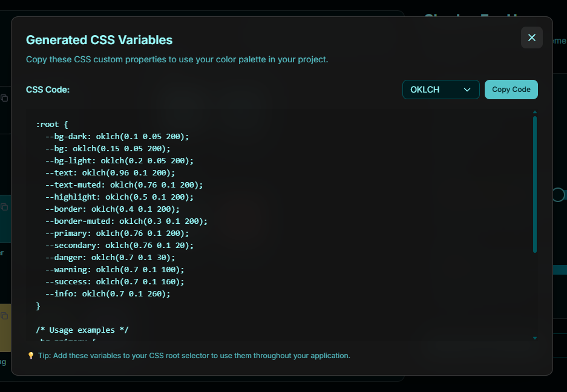

# Shades - Color Palette Generator

**Live App**: [shadesforus.vercel.app](https://shadesforus.vercel.app)

Shades is a powerful color palette generator that helps you create beautiful, accessible color schemes for your design projects. Using the modern Oklch color space, Shades generates consistent and visually pleasing color palettes that work across different themes and use cases.

## Features

- **Modern Color Space**: Uses Oklch color space for better color consistency and accessibility
- **Theme Support**: Generate both light and dark theme palettes
- **Multiple Export Formats**: Export colors in OKLCH, HEX, RGBA, and HSL formats
- **Real-time Preview**: See your palette changes instantly
- **CSS Export**: Get ready-to-use CSS custom properties
- **Color Picker**: Choose your base color with an intuitive color picker

## Getting Started

### 1. Explore Your Palette

Your generated palette includes colors for various design needs:



**Background Colors**
- `bg-dark`: Darkest background shade
- `bg`: Main background color
- `bg-light`: Lightest background shade

**Text Colors**
- `text`: Primary text color
- `text-muted`: Secondary or muted text

**Border Colors**
- `highlight`: Highlight border color
- `border`: Main border color
- `border-muted`: Subtle border color

**Action Colors**
- `primary`: Primary action color (buttons, links)
- `secondary`: Secondary action color

**Alert Colors**
- `danger`: Error states and warnings
- `warning`: Caution messages
- `success`: Success confirmations
- `info`: Informational messages

### 2. Choose Your Base Color

Start by selecting your primary color using the color picker. This will be the foundation of your entire palette.



- **Hue Slider**: Adjust the color hue (0-360 degrees)
- **Chroma Slider**: Control color saturation (0-0.4)
- **Theme Toggle**: Switch between light and dark themes

### 3. Export Your Colors

Choose your preferred color format and copy the generated CSS variables:



**Available Formats**
- **OKLCH**: Modern color space with better consistency
- **HEX**: Standard hexadecimal color codes
- **RGBA**: Red, Green, Blue, Alpha values
- **HSL**: Hue, Saturation, Lightness values

## Using Your Palette

### CSS Integration

Copy the generated CSS variables and add them to your project:

```css
:root {
  --bg-dark: oklch(10% 0.05 260);
  --bg: oklch(15% 0.05 260);
  --bg-light: oklch(20% 0.05 260);
  --text: oklch(96% 0.05 260);
  --text-muted: oklch(76% 0.05 260);
  --primary: oklch(76% 0.15 260);
  /* ... more colors */
}
```

### Usage Examples

```css
/* Background */
.my-component {
  background-color: var(--bg);
  color: var(--text);
}

/* Primary button */
.btn-primary {
  background-color: var(--primary);
  border-color: var(--primary);
}

/* Alert message */
.alert-danger {
  background-color: var(--danger);
  border-color: var(--danger);
}
```

## Tips for Better Palettes

1. **Start with a Base Color**: Choose a color that represents your brand or design theme
2. **Consider Accessibility**: The generated palettes maintain good contrast ratios
3. **Test Both Themes**: Always check how your palette looks in both light and dark modes
4. **Use Semantic Colors**: Leverage the alert colors for consistent user feedback
5. **Export in Your Preferred Format**: Choose the format that works best with your development workflow

## Browser Support

Shades uses modern CSS color functions that are supported in all current browsers:
- Chrome 111+
- Firefox 113+
- Safari 16.4+
- Edge 111+

For older browsers, consider using the HEX or RGBA export formats as fallbacks.

## About Oklch Color Space

Oklch is a modern color space that provides:
- **Better Perceptual Uniformity**: Colors appear more consistent across different brightness levels
- **Improved Accessibility**: Better contrast ratios and color differentiation
- **Future-Proof**: Aligned with modern web standards and color theory

---

## License

MIT License

Copyright (c) 2025 Deeptadeep Roy

Permission is hereby granted, free of charge, to any person obtaining a copy
of this software and associated documentation files (the "Software"), to deal
in the Software without restriction, including without limitation the rights
to use, copy, modify, merge, publish, distribute, sublicense, and/or sell
copies of the Software, and to permit persons to whom the Software is
furnished to do so, subject to the following conditions:

The above copyright notice and this permission notice shall be included in all
copies or substantial portions of the Software.

THE SOFTWARE IS PROVIDED "AS IS", WITHOUT WARRANTY OF ANY KIND, EXPRESS OR
IMPLIED, INCLUDING BUT NOT LIMITED TO THE WARRANTIES OF MERCHANTABILITY,
FITNESS FOR A PARTICULAR PURPOSE AND NONINFRINGEMENT. IN NO EVENT SHALL THE
AUTHORS OR COPYRIGHT HOLDERS BE LIABLE FOR ANY CLAIM, DAMAGES OR OTHER
LIABILITY, WHETHER IN AN ACTION OF CONTRACT, TORT OR OTHERWISE, ARISING FROM,
OUT OF OR IN CONNECTION WITH THE SOFTWARE OR THE USE OR OTHER DEALINGS IN THE
SOFTWARE.
